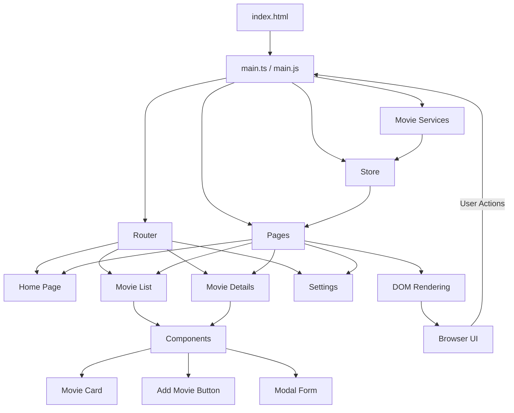

# Project Module Architecture

```mermaid
flowchart TD

    A[index.html] --> B[main.ts / main.js]

    B --> C[Router]
    B --> D[Pages]
    B --> E[Store]
    B --> F[Movie Services]

    C --> G[Home Page]
    C --> H[Movie List]
    C --> I[Movie Details]
    C --> J[Settings]

    D --> G
    D --> H
    D --> I
    D --> J

    H --> K[Components]
    I --> K

    K --> L[Movie Card]
    K --> M[Add Movie Button]
    K --> N[Modal Form]

    F --> E
    E --> D

    D --> O[DOM Rendering]

    O --> P[Browser UI]

    P -->|User Actions| B
```
